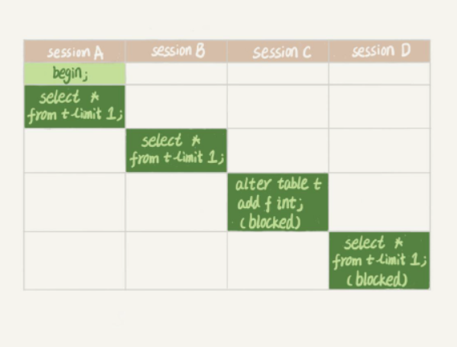

# ARTS0004

week 4
20190707

## Algorithm

[Leetcode 1110 Delete Nodes And Return Forest](https://github.com/evasnowind/LeetCodeOJ/tree/master/LeetCodeSolutions/src/oj_solution/oj_1110_del_node_ret_forest)

参见链接

## Review

[Creating a Fear-Driven Development Culture](https://dzone.com/articles/creating-a-culture-of-fear)

FDD…… 不过这个F是Fear，整篇文章算是举反例，告知大家应该如何进行开发工作：

1. 测试环境一定要与线上环境一致，保证测试的有效性、避免上线部署时才发现问题
2. 如果出了问题，一定要只针对事，而不要针对人

## Tips

1. mysql的小技巧：
   1. 通过 `mysql -hip地址  -u用户名 -p密码 数据库名`  这种方式连接到数据库时，默认连接可能不是utf8格式，这可能导致：
   
      1. 在当前连接下insert/update等命令更新数据库表，尤其是更新中文时，可能当前shell里明明显示正常，但用程序读出的中文是乱码，原因就是编码不一致导致的，因为库表一般默认utf8，而我们用mysql 命令在shell里更新信息、实际写入的数据可能不是utf8。
   
   2. 建议：连接时
   
      1. 方法1：` mysql -hip地址  --default-character-set=utf8  -u用户名 -p密码 数据库名`登录到数据库后，里面手工设置一下当前连接的编码格式，如下面命令： `set names utf8;`
   
      2. 方法2：直接在连接mysql库时就设置编码格式，即：`mysql -hip地址  --default-character-set=utf8  -u用户名 -p密码 数据库名 `这样登录
   
         当然，编码要设置成哪个要看数据库本身编码。

## Share

### 《MySQL实战45讲》听课笔记1-锁

1. 全局锁：做全库逻辑备份时使用
   表级锁：有表锁和元数据锁两种
   表锁：MyISAM使用
   元数据锁（meta data lock，MDL）：读数据自动加MDL读锁，修改表结构自动加MDL写锁
   间隙锁：锁数据行间隙（解决幻读）

   - 
   - 读锁之间不互斥
     读写锁、写锁之间互斥

2. 行锁：InnoDB实现的锁
   两阶段锁协议：在InnoDB事务中，行锁是在需要的时候才加上的，但并不
   是不需要是就立刻释放，而是等待事务结束时才释放。

   

3. InnoDB死锁怎么处理?

   1. 等待直到超时事务回滚（等待时间较长，往往业务无法接受）

   2. 发起死锁检测，发现死锁后主动回滚一个事务，让其他事务继续执行（有额外开销，死锁检测会消耗大量cpu资源）

   3. 上述InnoDB原生支持的死锁处理方式的缺点很突出，一般在高并发场景下会选择关闭死锁检测，再通过mysql中间件（或修改mysql源码）来控制并发度度来解决死锁问题

      